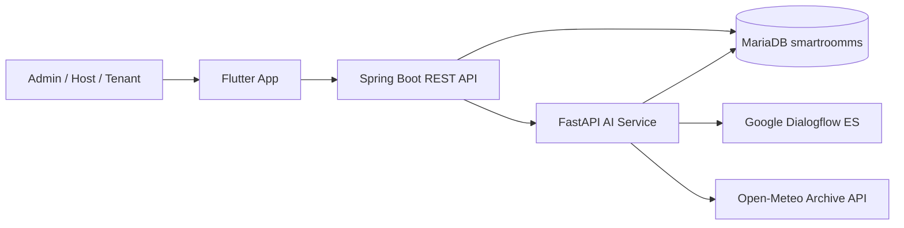

# SmartRoomMS - Phòng Trọ 4.0

SmartRoomMS là hệ thống quản lý phòng trọ gồm ứng dụng di động Flutter, REST API Spring Boot, cơ sở dữ liệu MariaDB và microservice AI dùng FastAPI/Dialogflow để hỗ trợ chatbot và phát hiện bất thường trong hóa đơn.

## Thành phần chính

| Thành phần | Công nghệ | Vai trò |
| --- | --- | --- |
| `Backend/` | Java 17, Spring Boot, Maven, Spring Security, JPA | API nghiệp vụ, xác thực JWT, quản lý Admin/Host/Tenant |
| `frontend/` | Flutter, Dart, Provider, GoRouter, Dio | Ứng dụng mobile/web cho Admin, chủ trọ và người thuê |
| `PhongTro40_AI/` | Python, FastAPI, Dialogflow ES, scikit-learn | Chatbot tiếng Việt, xử lý intent, phát hiện tiêu thụ bất thường |
| `db.sql` | MariaDB/MySQL | Schema, view và dữ liệu seed |
| `docker-compose.yml` | Docker Compose | Chạy đầy đủ MariaDB, Backend, AI và Frontend web |

## Tính năng nổi bật

- Xác thực JWT với 3 vai trò: `ADMIN`, `HOST`, `TENANT`.
- Chủ trọ quản lý khu trọ, phòng, khách thuê, hợp đồng, đặt cọc, hóa đơn, dịch vụ, thiết bị, sự cố và thông báo.
- Người thuê xem hợp đồng, hóa đơn, dịch vụ, thông báo, báo sự cố, tải minh chứng thanh toán và dùng chatbot.
- Admin theo dõi dashboard, doanh thu, chủ trọ và audit phòng.
- AI service xử lý truy vấn tự nhiên bằng Dialogflow, ghi nhận sự cố và cảnh báo bất thường điện/nước bằng Isolation Forest.
- Docker Compose dựng toàn bộ hệ thống cùng dữ liệu seed từ `db.sql`.

## Kiến trúc tổng quan



## Cấu trúc nhanh

```text
Project/
├── Backend/              # Spring Boot API
├── frontend/             # Flutter app
├── PhongTro40_AI/        # FastAPI chatbot/anomaly service
├── db.sql                # Database schema + seed
├── docker-compose.yml    # Full-stack local runtime
├── PROJECT_STRUCTURE.md  # Giải thích cấu trúc thư mục
└── README.md             # File giới thiệu cho GitHub
```

Xem chi tiết tại [PROJECT_STRUCTURE.md](./PROJECT_STRUCTURE.md).

## Chạy nhanh bằng Docker Compose

Yêu cầu: Docker Desktop hoặc Docker Engine có Compose plugin.

```bash
docker compose up --build -d
```

Sau khi chạy:

| Dịch vụ | URL |
| --- | --- |
| Frontend web | `http://localhost` |
| Backend API | `http://localhost:8080` |
| AI API | `http://localhost:8000` |
| AI Swagger | `http://localhost:8000/docs` |
| MariaDB | `localhost:3306`, database `smartroomms` |

Muốn reset database và import lại seed:

```bash
docker compose down -v
docker compose up --build -d
```

## Chạy từng phần khi phát triển

### Backend

```bash
cd Backend
./mvnw spring-boot:run
```

Trên Windows PowerShell:

```powershell
cd Backend
.\mvnw spring-boot:run
```

### AI Service

```bash
cd PhongTro40_AI
python -m venv .venv
source .venv/bin/activate
pip install -r requirements.txt
uvicorn app.main:app --host 0.0.0.0 --port 8000 --reload
```

Trên Windows PowerShell:

```powershell
cd PhongTro40_AI
python -m venv .venv
.\.venv\Scripts\Activate.ps1
pip install -r requirements.txt
uvicorn app.main:app --host 0.0.0.0 --port 8000 --reload
```

### Frontend

```bash
cd frontend
flutter pub get
flutter run
```

Chạy web:

```bash
flutter run -d chrome
```

## Cấu hình môi trường

- Backend có template tại [Backend/.env.example](./Backend/.env.example).
- AI service có template tại [PhongTro40_AI/.env.example](./PhongTro40_AI/.env.example).
- Không commit `.env`, `dialogflow-key.json`, service account key, file `.pem` hoặc `.key`.
- `Backend/src/main/resources/application.properties` chỉ giữ placeholder/dev fallback; secret thật phải truyền qua biến môi trường.

## Tài liệu theo module

- [Backend README](./Backend/README.md)
- [Frontend README](./frontend/README.md)
- [AI Service README](./PhongTro40_AI/README.md)
- [Project Structure](./PROJECT_STRUCTURE.md)

## Tài khoản demo trong seed

| Vai trò | Username/SĐT | Mật khẩu |
| --- | --- | --- |
| Admin | `0900000000` | `Admin@123` |
| Host | `0911111111` | `Host@123` |
| Tenant | `0980000000` | `Tenant@123` |

Các tài khoản demo được tạo trong `db.sql`. Mật khẩu trong database đã được hash bằng BCrypt.

## Kiểm tra chất lượng

```bash
cd Backend && ./mvnw test
cd frontend && flutter test
cd PhongTro40_AI && python -m compileall app
```

## Ghi chú GitHub

Thư mục đã được dọn các artefact có thể tái tạo như `target/`, `build/`, `.dart_tool/`, `ios/Pods/`, `.venv/`, log và metadata hệ điều hành. Repository root hiện có `.gitignore` để tránh đưa cache, build output và secret lên GitHub.
